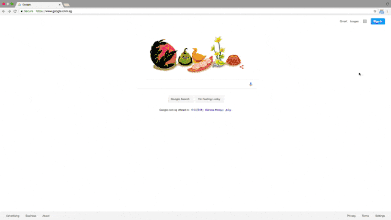

# Gridfull
## A WebExtension to see css structure by outlining. For css debug purposes. By [Boon](http://simboonlong.com/)

- requires Chrome Browser.

### Demo

### Features
* Toggle outlines on all elements.
* Color pick outlines color.

### Why?
- To understand/learn how to make browser extensions.
- For debugging css structure issues.

### Included plugins
1. Jquery.
2. [Spectrum color picker](https://github.com/bgrins/spectrum).

### Usage
1. To install, download a cloned copy locally.
2. Go to your Chrome browser extensions via [Preferences]. For Mac, press `cmd + ,` > click [Extensions] > check [Developer Mode] > click [Load unpacked extension].
3. Select your downloaded local copy folder and `Gridfull` should install.
4. Go to any website, click the `Gridfull` button on top right of your browser window.

### Better alternative
Pesticide @ [https://github.com/mrmrs/pesticide](https://github.com/mrmrs/pesticide).

